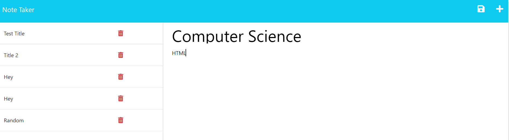

# Note-Taking System

```
Link to github repo:
https://github.com/Thaodev23/notes-taking-system

Link to heroku webpage:
https://notes-generate-284a706f5f38.herokuapp.com/notes
```

## User Story

```
AS A college student at the University of Minnesota
I WANT to have an efficient note-taking system
SO THAT I can take down notes faster
```


## Acceptance Criteria

```
GIVEN I have generated a note-taking system through express.js
WHEN I type in the command line "nodemon server.js"
THEN THE http://localhost:3001 will be initiated on the web browser
WHEN I clicked on the get started button on the note taker webpage
THEN I will be taken to another webpage where I can input my notes
WHEN I'M finish inputting my notes
THEN I can save my notes
WHEN I have saved my notes
THEN THE notes will be appear on the left-hand side of the webpage
WHEN I click on the saved notes
THEN THE data entry of the notes will appear to the right of it
```

## Image

Below: Image of an example of the note-taking system. 


## Collaborators

```
Jason Yang:
Github profile - https://github.com/Jasony95
Classmate that collaborated on the homework assignment together.
 ```

```
Sichoun Nplhaib Lee:
Github profile - https://github.com/DDXP3.
Classmate that collaborated on the homework assignment together.
```

